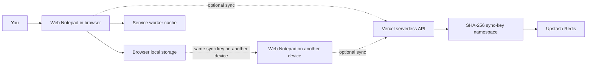
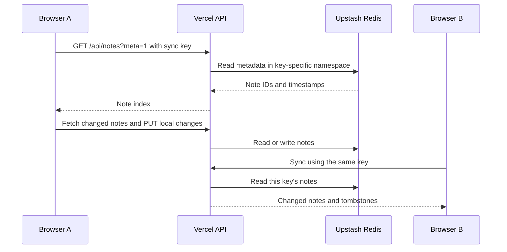

# Web Notepad

A private, browser-based notepad for formatted notes, checklists, sketches, and quick capture. It works without an account: notes save automatically in the current browser. Optional cloud sync lets you share notes across devices using a sync key, with Vercel Functions and Upstash Redis.

## Contents

- [Features](#features)
- [How It Works](#how-it-works)
- [Requirements](#requirements)
- [Run Locally](#run-locally)
- [Deploy to Vercel](#deploy-to-vercel)
- [Enable Cloud Sync](#enable-cloud-sync)
- [Use on a Phone or Install as an App](#use-on-a-phone-or-install-as-an-app)
- [Import, Export, and Backups](#import-export-and-backups)
- [Keyboard Shortcuts](#keyboard-shortcuts)
- [API Reference](#api-reference)
- [Data, Privacy, and Limits](#data-privacy-and-limits)
- [Troubleshooting](#troubleshooting)
- [Project Layout](#project-layout)

## Features

### Notes and editing

- Create, edit, search, pin, and delete multiple notes.
- Automatic local saving, plus an explicit **Save** shortcut.
- Rich-text formatting: paragraphs, three heading levels, quotes, code blocks, bold, italic, underline, strikethrough, text and highlight colors, lists, alignment, and links.
- Paste formatted content while preserving its appearance, or switch to plain-text paste. Pasted HTML is sanitized before insertion.
- Paste images from the clipboard into a note.
- Insert interactive checkboxes and todo lines. Press Enter in a todo line to add another item.
- Undo and redo for note text, checkboxes, page layout, shapes, and drawings.
- Find, replace the current match, or replace all matches.
- Focus mode, editor font choices, zoom controls, and word/character/read-time counts.
- Light and dark themes, with the initial theme following the operating-system preference.

### Page layout and drawing

- Choose free-size pages or A4, A4 landscape, A3, A3 landscape, A5, Letter, or Legal.
- Add rectangles, rounded boxes, ellipses, triangles, diamonds, stars, lines, and arrows.
- Draw freehand with a pen; erase freehand strokes; select, move, resize, restyle, and delete shapes.
- Configure stroke color, fill color, fill mode, and line width.
- Print notes or use the browser print dialog to save as PDF.

### Files and portability

- Import `.txt`, `.md`, `.html`, and `.htm` files as notes.
- Export the current note as `.txt` or `.html`.
- Download all notes as a JSON backup and restore notes by importing that backup.
- Copy note content with formatting or as plain text.

### Offline and installable app

- A service worker caches the app shell and serves it when the network is unavailable. Cloud sync still requires a network connection.
- Install the app from supported browsers. On iPhone or iPad, use **Share > Add to Home Screen**.
- A shortcut for creating a new note is included in the app manifest where supported.

## How It Works



Local notes and the offline app shell are separate: the service worker caches the application, while note data is saved in the browser's local storage. Sync is an optional path from the app to the API and Redis; the service worker does not cache API requests.

Cloud sync works by exchanging a small note index first, then fetching changed note bodies and uploading locally changed notes. Updates are resolved per note using the latest `updated` timestamp. Deletes are represented by sync tombstones so they can propagate to other devices.



## Requirements

- Node.js 18 or later for the local Vercel development server and serverless functions.
- npm, included with Node.js.
- A Vercel account to deploy the app and API.
- An Upstash Redis database connected to the Vercel project to enable cloud sync. This is optional; local note-taking works without it.

The frontend is a static HTML application and has no frontend build step. The only npm dependency is `@upstash/redis`, used by the API functions.

## Run Locally

The recommended local workflow uses Vercel CLI, which serves the static app and runs the functions under `api/`:

1. Install Node.js 18 or newer.
2. Open a terminal in the project directory.
3. Install the dependencies and Vercel CLI:

   ```sh
   npm install
   npm install --global vercel
   ```

4. Start the local development server:

   ```sh
   vercel dev
   ```

5. Open the local URL printed by Vercel, typically `http://localhost:3000`.

The editor and local browser storage work without Redis. To test cloud sync locally, connect a Redis database to the Vercel project and pull its environment variables into the local project using the Vercel CLI, or create a local `.env` file with `UPSTASH_REDIS_REST_URL` and `UPSTASH_REDIS_REST_TOKEN`. Do not commit `.env` files or disclose these credentials.

Opening `public/index.html` directly can be useful for a quick UI check, but it does not run `/api/*`, and service-worker installation requires a secure context (normally HTTPS or localhost). Use `vercel dev` to test the deployed app structure.

## Deploy to Vercel

1. Create a Git repository and push this project to GitHub, GitLab, or another Git provider supported by Vercel.
2. In Vercel, select **Add New > Project**, import the repository, and choose **Other** as the framework preset.
3. Leave the build command empty. The site is static and the `api/` directory contains Vercel Functions.
4. Deploy the project.
5. Open the deployment URL and confirm the editor loads. Without Redis, it remains usable with browser-local storage.
6. To enable sync, add an Upstash Redis integration from the Vercel project's **Storage** or Marketplace section and connect it to this project.
7. Confirm the environment variables `UPSTASH_REDIS_REST_URL` and `UPSTASH_REDIS_REST_TOKEN` are available to the deployment. Redeploy after connecting storage or changing environment variables.
8. Check `https://YOUR-DOMAIN/api/health`. A healthy configured response resembles:

   ```json
   {"api":"up","storage":"configured","redis":"ok"}
   ```

Use the production domain for phone sync if Vercel Deployment Protection blocks preview deployments. Alternatively, adjust the deployment protection settings for the deployment you intend to use.

## Enable Cloud Sync

1. Deploy the app and connect Upstash Redis as described above.
2. In the app, select **Sync: off** to open Cloud sync.
3. Select **Generate** for a random key, or enter your own key containing 16 to 128 letters, numbers, underscores, or hyphens. Keys are normalized to lowercase and whitespace is removed.
4. Select **Save & sync**. The app downloads remote notes and uploads local changes.
5. On another device, open the same site and provide the same key, or use **Share sync link** on the first device. Check that the displayed **Key ID** matches on both devices.
6. Use **Sync now** to request a sync immediately. The app also syncs periodically while visible, on return to the page, and when the browser comes online.

The sync key is a bearer secret: anyone who obtains it can access the notes in its namespace. Store it safely. A share link includes the key in its URL fragment; sharing that URL grants access to those notes.

To stop syncing on a device, open Cloud sync and select **Turn off**. Existing local notes remain in that browser.

## Use on a Phone or Install as an App

1. Open the production HTTPS domain on the phone.
2. To bring over synced notes, either enter the same sync key in Cloud sync or select **Share sync link** on the computer and open the link on the phone.
3. Confirm the Key ID matches the other device.
4. Install the app:
   - Chrome, Edge, and supported Android browsers may show an install prompt or an install icon in the address bar.
   - On iPhone or iPad, open the browser's **Share** menu and select **Add to Home Screen**.

The service worker makes the app shell available offline after it has been loaded online. Notes are available offline only on devices where those notes have already been stored locally. Sync operations need a connection.

## Import, Export, and Backups

- **Import a text or Markdown file:** select **Import** and choose a `.txt` or `.md` file. Its filename becomes the note title.
- **Import HTML:** choose `.html` or `.htm`; unsafe elements and event attributes are removed before content is added.
- **Restore a backup:** choose a JSON backup created by **Backup all**. Imported notes are added as new notes rather than replacing existing ones.
- **Export one note:** open **Export** and choose **Download .txt**, **Download .html**, **Print**, or **Save as PDF**. PDF output is created by the browser's print dialog.
- **Back up regularly:** select **Backup all** and store the downloaded JSON file somewhere separate from this browser. Browser storage can be cleared by the user, browser settings, or device cleanup tools.

## Keyboard Shortcuts

| Shortcut | Action |
| --- | --- |
| `Ctrl/Cmd + S` | Save immediately to browser storage and request sync |
| `Alt + N` | Create a new note |
| `Ctrl/Cmd + H` | Open find and replace |
| `Ctrl/Cmd + Z` | Undo |
| `Ctrl/Cmd + Y` or `Ctrl/Cmd + Shift + Z` | Redo |
| `Ctrl/Cmd + B` | Bold selected text |
| `Ctrl/Cmd + I` | Italicize selected text |
| `Ctrl/Cmd + U` | Underline selected text |
| `Ctrl/Cmd + P` | Open the browser print dialog |
| `Ctrl/Cmd + +` or `Ctrl/Cmd + =` | Zoom in while the editor is focused |
| `Ctrl/Cmd + -` | Zoom out while the editor is focused |
| `Ctrl/Cmd + 0` | Reset zoom while the editor is focused |
| `Esc` | Close menus/find and replace and leave focus mode |

On macOS, use `Cmd` where the table says `Ctrl/Cmd`. Browser and operating-system shortcut behavior may vary.

## API Reference

The API is implemented as Vercel serverless functions in `api/`.

| Method and path | Purpose | Authentication |
| --- | --- | --- |
| `GET /api/health` | Reports API status, whether storage environment variables exist, and whether Redis responds to ping. | None |
| `GET /api/notes?meta=1` | Lists note IDs, titles, timestamps, deletion state, and pin state without note bodies. | `x-sync-key` header |
| `GET /api/notes?id=NOTE_ID` | Fetches one note. Without `id`, fetches the note collection. | `x-sync-key` header |
| `PUT /api/notes` | Creates or updates one note using a JSON `{ "note": { ... } }` request body. | `x-sync-key` header |

The sync key must be 16 to 128 characters. The server hashes it with SHA-256 to derive a Redis namespace; the raw key is not stored by the API. Note content is not end-to-end encrypted by this application. See [Data, Privacy, and Limits](#data-privacy-and-limits).

## Data, Privacy, and Limits

- **Local-only mode:** notes are stored in the browser's `localStorage` for that site and browser profile. They are not automatically available in another browser or device.
- **Synced mode:** note data, including formatted HTML and drawing metadata, is stored in the connected Upstash Redis database. The server uses a SHA-256 hash of the sync key as the namespace identifier; this is not content encryption.
- **Access control:** possession of the sync key grants access to that key's notes. Choose a hard-to-guess key and avoid sharing it publicly.
- **Conflict handling:** sync uses timestamps and applies the latest edit per note. This is not collaborative real-time editing; simultaneous changes to the same note may result in one version winning.
- **Deletion:** synced deletes are retained as tombstones to propagate deletion to other devices. Turning sync off does not delete local or remote notes.
- **Limits enforced by the API:** up to 500 note records per sync key; note HTML is limited to 3,000,000 characters and serialized extra metadata to 500,000 characters. Large pasted images can exceed sync limits because images may be embedded in note HTML.
- **Backups:** the JSON backup includes live notes. Keep an independent backup if the notes matter; Redis sync is not a substitute for an export.
- **Transport:** use HTTPS for deployed sites, particularly when entering or sharing a sync key.

## Troubleshooting

### Sync is unavailable or says it cannot reach the server

1. Open **Cloud sync > Test connection**. The result distinguishes connectivity, API deployment, Redis configuration, and deployment protection problems.
2. Visit `https://YOUR-DOMAIN/api/health`. Check for `"storage":"configured"` and `"redis":"ok"`.
3. In Vercel, confirm the Upstash integration is connected and that `UPSTASH_REDIS_REST_URL` and `UPSTASH_REDIS_REST_TOKEN` are set for the deployment environment. Redeploy after making changes.
4. Confirm the deployed project includes the `api/` directory and open the production URL if a preview deployment is protected.
5. Check the Key ID on each device. The IDs should match when the same sync key is in use.

### The phone says Vercel is blocking the URL

Open the production domain instead of a protected preview URL, or change Deployment Protection for that deployment.

### A note will not sync

The API rejects notes above the limits listed above and permits at most 500 note records per key. Remove large embedded images or reduce content, then sync again. The app's **Test connection** action can verify API and Redis availability.

### Notes seem missing

Check that the same browser profile is being used for local-only notes, or that the same Key ID is active on every synced device. Import the most recent JSON backup if needed. Do not clear site data until you have checked for a backup.

## Project Layout

```text
.
|-- api/
|   |-- health.js       # API and Redis health check
|   `-- notes.js        # Note list, fetch, and upsert endpoints
|-- public/
|   |-- index.html      # Complete single-page notepad application
|   |-- manifest.json   # Installable web app metadata
|   `-- sw.js            # Offline app-shell caching
|-- package.json        # Node engine requirement and Upstash dependency
`-- README.md
```
